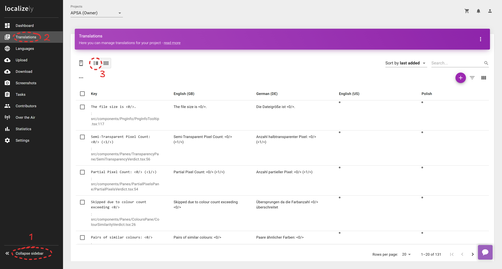
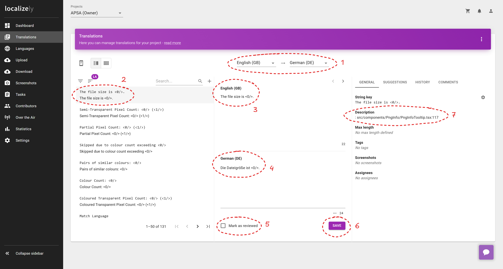
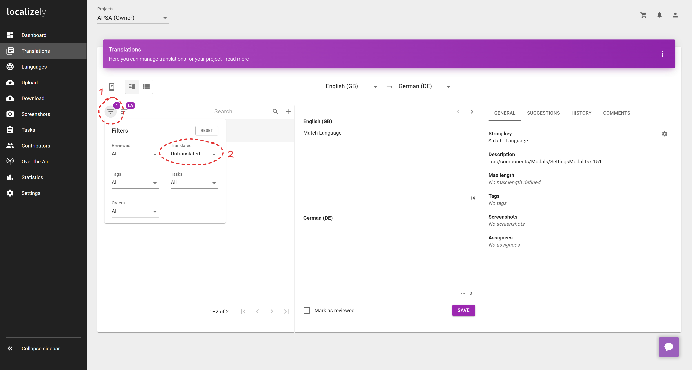

# Translation

If you're on this page there's a strong chance you're interested in helping with the translation work for APSA!
Contributions of all sizes are welcome, from fixing small mistakes to adding entire new supported languages.

To start out you first need to contact Fiddlekins.

The best way to do so is by messaging `@fiddlekins` in the following APSA topic in the official Pokémon Infinite Fusion Discord server: https://discord.com/channels/302153478556352513/1253038047554048050

If you'd rather avoid this method you can contact Fiddlekins via email at `fiddlekins@gmail.com` instead.

Alternatively, if you're familiar with using GitHub you can avoid both of the above methods and instead submit a pull request with edits or additions, and any further details can be discussed there.

**There are two ways to work on translations:**

## 1. [localizely](https://localizely.com/)

This is a third party service that makes collaborative translation work easier.
The main advantages versus manually editing the raw files on this project are:
- has a graphical interface for editing translations, saves translators learning the syntax of the raw text files
- can quickly filter out completed translation entries, making it simpler when translating a few newly added entries

To get started you'll need Fiddlekins to invite you to the localizely project.
This is done by providing an email address.

Be sure to use something you don't mind being publicly associated with your Discord account / online identity!
It isn't clear how discreet localizely keeps this (e.g. can other collaborators see one another's email?) so if you're privacy conscious it's best to use an email address you don't mind being public.

You should then receive an email confirming your invitation to the project, and can now sign in to localizely.

Head to https://app.localizely.com/ and you'll probably default to the right project due to only having one.
If not, manually select "APSA" form the project dropdown menu.

### Using localizely

The following is a basic walkthrough of what the platform looks like and which features we're most interested in.
Refer to the final section of this document for generic guidance about how to translate.

#### Step 1



1. First expand the sidebar if it starts collapsed
2. Click on the "Translations" sidebar entry
3. You'll probably default to the view with every language displayed horizontally as columns. This can be handy for an overview, but you'll want to click the little button that changes the view to display only two languages at a time

#### Step 2



1. First, configure the language pair using the dropdown menus
   - The language on the right is the language you're translating into, a.k.a. the "output language"
   - The language on the left is the "input language" and can be anything, but it's preferable to use "English (GB)" since that's the original text. Using a different language has greater potential for the meaning to drift from the original
2. On the left we have a list of text entries. You can select them to open them up for editor in the panes to the right
   - The text entry consists of a "key" and a "value"
   - The value is the currently selected input language's translation for this key
   - The key is arbitrary text and used by the code as a means of identifying this translated text, but the software used sets the key to the default language translation
3. This is the input language translation
4. This is the output language translation, and is where you enter new text to update or add a translation
   - In this screenshot there is already a german translation present, but for a new language the box will be empty
5. There is a review system so that multiple translators can check each other's work, but we won't be making use of it so just mark every translation you submit as reviewed by ticking this checkbox
6. Once you've made your edits, press "Save" to persist those changes
7. The "Description" text is derived from comments automatically generated by the software that extracts these translations from the APSA source code. It mostly just says where the text is used within the source code, so in this example we see that the text is used by something called "Png Info Tooltip". This will largely not be too useful for translators, but at times it can make it easier to figure out how some text is used

#### Step 3



1. Last thing to take note of is the filter button. Pressing it opens the filter menu
2. Here you can set it to only show untranslated entries. This makes life a lot easier when APSA updates and adds some new translations, as they can be quickly found and completed

That's it! Once you've submitted translations in this way, just message Fiddlekins and they will handle the process to get them from localizely into APSA itself.

## 2. Manually editing text files

The following is a basic walkthrough of how to find the text files and what to do with them.
Refer to the final section of this document for generic guidance about how to translate.

### Format

For this project the files that store all the translations can be found in [this folder](.).
They are named `<locale code>.po` and can be opened in plaintext editors, such as Notepad on Windows devices.

This `.po` format is called "gettext" after the name of [the software](https://www.gnu.org/software/gettext/) that invented it.

Here's an example entry:

```gettext
#: src/components/IdTooltipContent.tsx:33
msgid "The full ID is:<0/>{id}"
msgstr "Die ganze ID ist:<0/>{id}"
```

#### Comments
Lines that begin with `#` are comments, and can have any text following them.
The character that follows the `#`, this case a `:`, determines what type of comment it is, but you don't need to worry about that much.

The comments you see for the first time are autogenerated by the software used to extract the translated text from APSA's source code, and most look like the example above.
This comment is saying that the translation text is used in the source code in a file named "Id Tooltip Content".
This can at times be helpful in figuring out the context for the text, and maybe finding it within the live APSA website to see how it's used.

#### Keys

Lines that begin with `msgid` should **not** be edited.
These are used by the code to link the translations together and put them in the right place in APSA.
Note that the ID here is also the en-GB translation for this text.

#### Values

Lines that begin with `msgstr` are the translation for this bit of text.

Note that the `"` characters in the example are not part of the text that displays.
They are instead used by the software to recognise the start and end of the translation.
If you need to put `"` characters in the translated text, you must use something known as an "escape character" to tell the software that the `"` that comes after it is part of the text and not the end of it.
In this case, the escape character is `\` so you would write `\"`.

More complex escape sequences are omitted in this guide, as per the "Special characters" section below.

### Methods

If you're working on a language that doesn't have an existing `.po` file you can start with the [pseudo-LOCALE](https://github.com/Fiddlekins/aio-pif-sprite-analyser/blob/master/src/locales/pseudo-LOCALE.po) one, as that has none of the translation values filled in yet.
If you're fixing or adding translations to an existing language, grab its `.po` file instead.

As mentioned, these `.po` files can be opened with any plaintext editor on your system.

You can also use [this tool](https://pofile.net/free-po-editor) without registering an account, which you may find easier to use due to it handling the special syntax under the hood and leaving you to input translated values without worrying about escape sequences as much.
Use the "Save" button in the top right corner after making edits to download a new file with the edits included.

In both cases there is unfortunately no quick way to jump to missing translations, and instead you just need to scroll through until you find them manually.

Once you've made new versions of these `.po` files you need to get them back to Fiddlekins.
If you're familiar with GitHub then you can make a pull request with the changes.
If you're not familiar, or prefer not to associate your GitHub account with the project, you can send the files to Fiddlekins over Discord or email.

## General Translation Guidance

### Template values

A core feature of translation software is the ability to put values that can change into a bit of text that otherwise remains the same.

To understand why these are important, consider a basic example where we are greeting a user when they open our application. We can't have a translation for every possible username - we don't even know in advance what those usernames would be! We could set the text to "Hello user!" so that we only have one thing to translate, but that would be a bit impersonal. Instead, we make the username a template value in the text "Hello {username}!" and swap it out with their actual name when we display it.

Here's an example from APSA, the en-GB text followed by the de-DE translation:

```
The full ID is:<0/>{id}
```

```
Die ganze ID ist:<0/>{id}
```

There's actually two versions of template syntax here, `<n/>` and `{varName}`. The difference is based on whether the value being inserted is HTML or plain text, but you don't need to worry about that - just be aware there's two styles to watch out for.

What's vitally important is to keep these template values in the translation. 

You can move them around and reorder them so that the translation obeys the target language's grammar rules, but if they're omitted or corrupted (missing a character, or changed the number or text inside the funny symbol sequence) then APSA isn't going to show everything it's meant to when it displays the translation.

(Don't worry _too_ much though - Fiddlekins is tasked with manually reviewing everything anyway, and can fix small mistakes)


### Special Characters

There are several layers of text processing involved, with some varying depending on which method you use to submit translations.
Each other these potentially introduce quirks relating to handling special characters.
Since most of these are not likely to be encountered for the sort of text that APSA actually uses, this guide will not provide specific advice.

Instead, just be aware that the following characters might cause unexpected results by the time the text is displayed in APSA:
`" ' \ { } < > %`

If you notice text displaying wrong in APSA and suspect it might relate to special character usage, message Fiddlekins and force them to figure out a solution.

### Tone and style

The tone and style of the English text used in APSA can be described as "pretty dry, neutral, somewhat formal, proper punctuation".
The intention is to try and convey precise meaning to readers, and so it avoids a more playful or humorous since that can be more prone to confusion. 
It errs on the side of verbosity rather than brevity for explanatory prose, whilst for UI labels it attempts the opposite to ideally make basic navigation more intuitive.

If you feel a different style is more appropriate for the language you are translating into, then by all means take that approach instead.
If there are multiple translators competing (rather than collaborating) over a single language then priority is given to the one that argues their style best represents the English version. 

### Terminology

Some of the terminology gets quite technical, and it might not be obvious how this should be translated.
Apologies are given to those who read this especially un-fun segment of this document.

The general recommendation when in doubt is to check the target language's wikipedia articles that discuss the subject and take inspiration from the terms used there.

#### PIF original terminology

Some terms have been made up to talk specifically about Pokémon Infinite Fusion related phenomena:

These include:
- "similar colours" / "similarity"
  - Whilst the concept of colour similarity has an expansive technical domain, the computation used by APSA and the Discord bot does not adhere to any standard method (instead a hybrid of multiple) so this term is used in a more colloquial sense
- "sprite colours" / "background colours"
  - Sprite colours refer to any colours that are part of the visible sprite, as opposed to being a "background colour" which is not visible and used as part of the fully transparent background
- "coloured transparency" / "coloured transparent pixel"
  - This refers to when pixels have 0% opacity/alpha but rather than being 0,0,0 for the r,g,b channels they are "coloured" instead
  - Whilst this phenomenon and downstream quirky behaviour is not unique to PIF, it isn't clear that there's formal terminology to discuss the matter
- "normalise transparency"
  - Relates to "coloured transparency", and is the name of the process by which coloured transparency is replaced by transparent black

#### Formally defined terminology

The following has English wikipedia articles for various terms.
These articles are typically highly technical and there is no expectation that you read or understand them, and are instead linked only in case it helps clarify what is being discussed if the terms are ambiguous on their own.

The following guidance about when terms are translated or left as their English version is currently based on what seemed sensible for the German translation.
If you have good reason to deviate from this, contact Fiddlekins to discuss in more detail.

These include:
- "[RGB](https://en.wikipedia.org/wiki/RGB_color_model)" / "[HSV](https://en.wikipedia.org/wiki/HSL_and_HSV)" / "[HSL](https://en.wikipedia.org/wiki/HSL_and_HSV)"
  - These are [colour models](https://en.wikipedia.org/wiki/Color_model), where the letters refer to "[channels](https://en.wikipedia.org/wiki/Channel_(digital_image))" e.g. RGB has an R channel, a G channel and a B channel
  - In APSA these channel acronyms and letters are not translated
  - However, the full name for a channel (e.g. R channel is the "red" channel) is translated
- "[sample](https://en.wikipedia.org/wiki/Sampling_(signal_processing))" / "[component](https://www.sciencedirect.com/topics/computer-science/color-component)" / "[channel](https://en.wikipedia.org/wiki/Channel_(digital_image))"
  - Within the context of APSA these three terms can be considered to mean the same thing, simply referring to the different values that make up a colour
  - The different names come from the history behind the different scientific fields that developed them, but for translation purposes the target language might prefer one to another and they can be interchanged accordingly
- "[PNG](https://en.wikipedia.org/wiki/PNG)"
  - You probably know this one already, but it's the digital image format used by PIF
- "[Colour Type](https://en.wikipedia.org/wiki/PNG#Pixel_format)"
  - Used by the PNG format to handle different kinds of images with more efficient file sizes (e.g. black and white images don't need as much data per pixel since they lack hue information)
  - The name is part of the PNG specification, and translated according to the target language's wikipedia entry
    - e.g. we can see that the [German entry](https://de.wikipedia.org/wiki/Portable_Network_Graphics#Pixelformat:~:text=Farbtyp%20und%20Bittiefe-,Farbtyp,-Kan%C3%A4le) uses "Farbtyp", so that's the term used in the translation for APSA
- "[bits](https://en.wikipedia.org/wiki/Bit)" / "[bytes](https://en.wikipedia.org/wiki/Byte)"
  - Names for specific lengths of digital information
  - You're likely already familiar with the target language's translation of byte, and should consult wikipedia for the equivalent translation for bit
- "monotone"
  - Just means "one colour" in English, and within APSA refers to a display option that only uses a single colour for highlighting pixels on the sprite
- "[negative](https://en.wikipedia.org/wiki/Negative_(photography))"
  - The term conceptually refers to how physical photography works, where there's an in-between stage where the image has been inverted. Borrowing on this concept, digital editing software use the term when describing filters that invert pixel colours
  - In APSA, the "negative" button configures the highlight mode to replace highlighted pixels with a colour representing its RGB encoded negative (e.g. calculated by subtracting the red channel from the max red value, the green channel from the max green value, etc...)
  - When translating this you can be somewhat loose with terminology as the exact function isn't too important, the feature is simply there to provide an option where highlights stand out more from non highlighted pixels
- "rotate"
  - This term refers to the concept behind how [Hue](https://en.wikipedia.org/wiki/Hue) works in colour models that use it, wherein it's a rainbow coloured wheel that loops back on itself. Since it's circular, when changing hue you are "rotating" the value
  - In APSA, the "rotate" button configures the highlight mode to replace highlighted pixels with a colour that has had a 180 degree hue rotation, whilst retaining its original lightness and "value" in the HSV representation of the colour
  - As with "negative" you can be somewhat loose with the translation, since the feature's exact functioning isn't vital
- "normal" vs "[indexed](https://en.wikipedia.org/wiki/PNG#Pixel_format:~:text=16-,Indexed,-1)"
  - These are options in the Export Sprite menu, and dictate how the PNG encoding is performed
  - Indexed mode is also known as "palette" mode, and the image is encoded with a list of colours (the palette) and pixel values that just point back to that palette
  - In contrast, "normal" mode is any of the other PNG Colour Types (discussed a bit above) which lack a palette and instead have the full colour representation of every pixel stored by that pixel directly
  - It is preferable that "indexed" is translated to the term used by the target language's version of the PNG specification, by using whatever the target language wikipedia article uses. This is not strictly important, however, as image software often refers to it as "palette mode" so it should be understood by users even if a more colloquial term is used
  - When translating "normal" there is no technical term for it, so a translation can be picked quite freely. What is important though is to encourage users to default to that mode (since the Discord bot can't handle indexed mode encoded sprites properly) so something like "normal" or "default" helps steer this behaviour